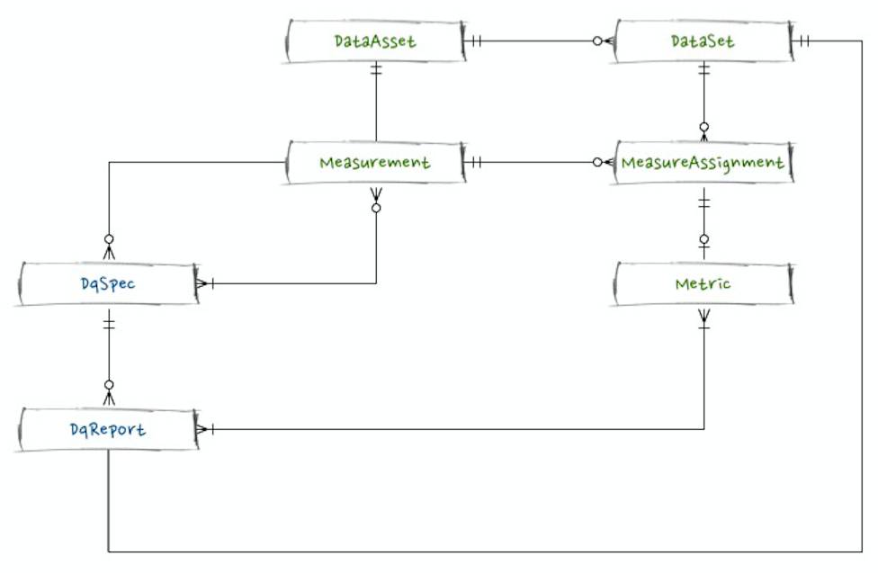
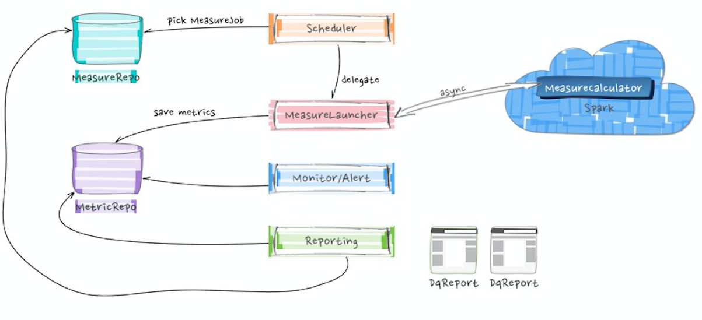

# architecture
  
Griffin is designed to help you assess the data quality in different dimentions.

## conceptual model

### Vocabulary

** Data Quality **

The representation of degree to which data meets the expectations of data consumers, based on their intended uses of the data.

Data Quality is described by a set of measurement values, which define the data quality from different perspective.

** Measurement: **
A deterministic and indicative perspective of data quality. It defines what need to be measured.

A Measurement should be independent on a concrete of DataAsset, so it describes a specific perspective deserve measuring.

** DataAsset: **
The data container whose quality need to be assessed. A *DataAsset* defines a certain type of data, with same data structure and definition.

In most of cases, A *DataSet* is not a fixed, where the content is actually different in different timepoint. So that it is hardly to define the data quality against a whole *DataAsset*.

By separating a *DataAsset* to a series of *DataSet* by a certain criteria, say by time-window. The data quality of a *DataAsset* is tranformed to the data quality of a series of *DataSet*s.

Time-window is a straightforward seapration strategy, which can cover most type of *DataSet*.

Batch data and streaming data could share a same abstraction in the way of time-window.

** DataSet **
A part of data within a DataAsset, which is actually the concrete objective to measure the Quality.

** MeasureAssignment **
A combination of a DataSet and a Measurement, from which a measuring process could be really executed. It could be also think of a concrete data quality measuring job.

** MeasureCalculator **
This is actually a computation parser which calculate against a *MeasureAssignment* and produce a *Metric* accordingly.

** Metric **
The result of a MeasurementAssignment processing, which consists of both unit and value in most of cases.

A *Metric* is to indicate how good/bad a DataSet's quality is, in the certain type of perspective specified by the measurement.

## Component

### MeasureRepo

A Measurement storage, together other required meta info persisted.

Measurement entities are stored here, in form of its class hierarchical structure. Different type Measurement could have its specific fields (Accuracy measurement needs different meta info from a non-null completeness measurement). Within MongoDB, it is covered by nature.

The Repository interface should be able to get a concrete type of Measurement instance, instead of a base Measurement instance. Spring-data-mongo should be easy to achieve this. With a concrete and accurate type of Measurement instance, the downstream operation should be easily handled by the OO polymorphism.

DataAsset Repository is actually a similar case, because of it's also a hierarchical strucutre.

### Scheduler

It decided when and which MeasureAssignment will be selected to calculate. 

The selection logic could be variant in various case: 

* When, when a certain external-condition matched, say time trigger, a file ready or a message arrived.
* Which, when a internal condition matched, say the MeasureAssignments with highest priority and earliest timestamp. 

Coordinating computation resources could be also a responsibility of Scheduler, for example there should not be too much MeasureAssignment scheduled in a certain time period.

### MeasureLauncher

At a certain timepoint, with a selected MeasureAssignment, MeasureLauncher is responsible for launching the measuring calculation and collecting the metric result. Instead of acutally handling the calculation itself, it cover the input/out part, specifically, it emit a async invocation request, and collection the calculation result back and persist them into MetricRepo.

### MetricRepo

It is based on a timeseries DB, influxDB. All Metric will be stored here.

### MeasureCalculator

The real algorithm or strategy to evaluate the metric value of a MeasureAssignment. 

MeasurementCalculator will be on a different env from the other components else, since we need to leverage a different computation framework (hadoop, spark, mesos...).

### Monitor/Aert

Monitor the system running status, including:
* MeasureAssignment status
* catch pre-defined exceptional case, e.g., Metric changes in timeline
* catch pre-defined event, e.g., watched job finished.
* detecting a pre-defined anomal case based on metrics histroy, or even reference data.

In case of an expected event occurence, alerting will send out a notification out, to pre-defined recipee. The content of notification is based on a pre-defined template, together with the event payload. The notification type could be variant, email, slack, wechat, msg...

### Reporting

Based on the pre-defined DqSpec, a series of DqReport (scorecard) will be generated as a result Data Quality assessment.

The report could be sent out periodically (as an alert).

## Batch & Streaming

Griffin will support both Batch data and Streaming data.

Besides the timeliness difference, they can be unified to a same abstraction: time-window. Streaming data could be consider as a series of continuously micro-batch data.

### challenge

### DataSet detection/creation

The datasets of a batch DataAsset is deterministic in timeline, so griffin can create datasets before launching it. On the other side, the datasets of a streaming DataAsset is hard (or expensive) to create before launching it.

### Metrics grainularity

One batch type of MeasureAssignment has only one Metric, while a streaming type of MeasureAssignment could have more, which actually depends on the micro-batch time-window definition.
